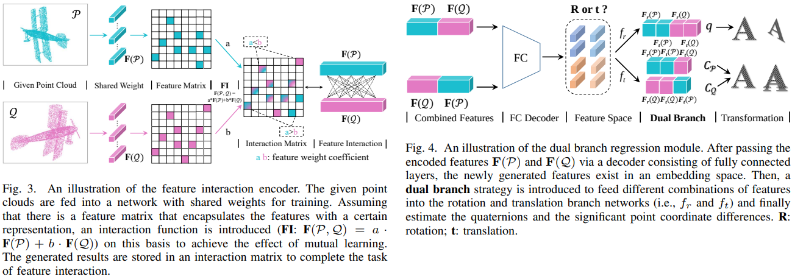

# [IEEE CIM 2023] Correspondence-free Point Cloud Registration via Feature Interaction and Dual Branch

#### [Paper Link]() | [Project Page](https://github.com/ywu0912/TeamCode/tree/liujia99/CFNet) 

## Introduction

In this paper, CFNet, a correspondence-free point cloud registration framework based on feature metrics and reconstruction metrics, is proposed to learn adaptive representations, with an emphasis on optimizing the network. Considering the correlations among the paired point clouds in the registration, a feature interaction module that can perceive and strengthen the information association between point clouds in multiple stages is proposed. To clarify the fact that rotation and translation are essentially uncorrelated, they are considered different solution spaces, and the interactive features are divided into two parts to produce a dual branch regression.



## Citation

If you entrust our work with value, please consider giving a star ⭐ and citation.

```bibtex
@article{wu2023correspondence,
  title={Correspondence-free Point Cloud Registration via Feature Interaction and Dual Branch},
  author={Wu, Yue and Liu, Jiaming and Yuan, Yongzhe and Hu, Xidao and Fan, Xiaolong and Tu, Kunkun and Gong, Maoguo and Miao, Qiguang and Ma, Wenping},
  journal={IEEE Computational Intelligence Magazine},
  year={2023},
  publisher={IEEE}
}
```
