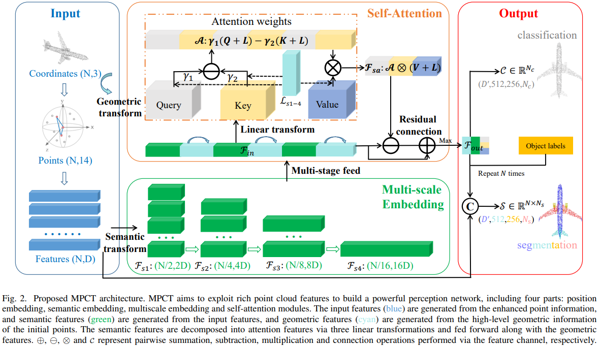

# [IEEE TMM 2023] MPCT: Multiscale Point Cloud Transformer with a Residual Network

#### [Paper Link]() | [Project Page](https://github.com/ywu0912/TeamCode/tree/liujia99/MPCT/) 

## Introduction

This paper presents a new framework called multiscale point cloud transformer (MPCT), which improves upon prior methods in cross-domain applications. The utilization of multiple embeddings enables the complete capture of the remote and local contextual connections within point clouds, as determined by our proposed attention mechanism. Additionally, we use a residual network to facilitate the fusion of multiscale features, allowing MPCT to better comprehend the representations of point clouds at each stage of attention.



## Citation

If you entrust our work with value, please consider giving a star ⭐ and citation.

```bibtex
@article{wu2023mpct,
  title={MPCT: Multiscale Point Cloud Transformer with a Residual Network},
  author={Wu, Yue and Liu, Jiaming and Gong, Maoguo and Liu, Zhixiao and Miao, Qiguang and Ma, Wenping},
  journal={IEEE Transactions on Multimedia},
  year={2023},
  publisher={IEEE}
}
```

## Acknowledgements

Our code borrows from [PCT](https://github.com/Strawberry-Eat-Mango/PCT_Pytorch) repository. We thank the authors of PCT for releasing their code. 