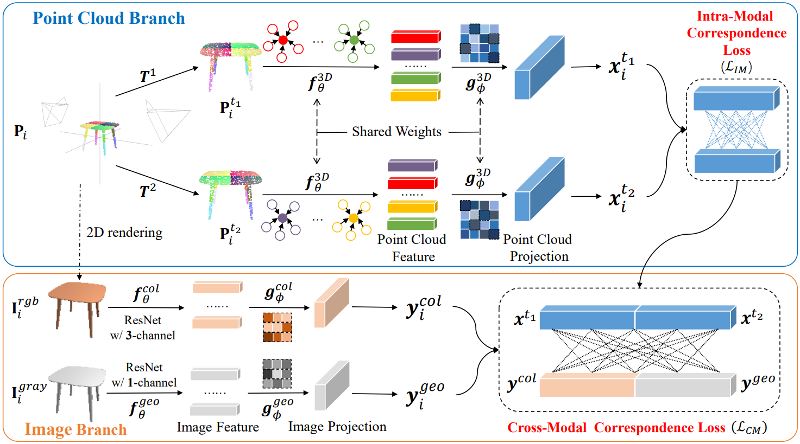

# [TMM 2023] Self-Supervised Intra-Modal and Cross-Modal Contrastive Learning for Point Cloud Understanding

#### [Paper Link](https://ieeexplore.ieee.org/abstract/document/10147273/) | [Project Page](https://github.com/liujia99/CrossNet/) 

## Introduction

This paper proposes a self-supervised point cloud understanding method called CrossNet. CrossNet is simple and efficient, developing the intra-modal contrastive loss between the point clouds and the cross-modal contrastive loss between the point clouds and images. Finally, we combine the overall training objectives.



## Citation

If you entrust our work with value, please consider giving a star ⭐ and citation.

```bibtex
@article{wu2023self,
  title={Self-Supervised Intra-Modal and Cross-Modal Contrastive Learning for Point Cloud Understanding},
  author={Wu, Yue and Liu, Jiaming and Gong, Maoguo and Gong, Peiran and Fan, Xiaolong and Qin, AK and Miao, Qiguang and Ma, Wenping},
  journal={IEEE Transactions on Multimedia},
  year={2023},
  publisher={IEEE}
}
```

## Dependencies

Refer `requirements.txt` for the required packages.

## Download data

Datasets are available [here](https://drive.google.com/drive/folders/1dAH9R3XDV0z69Bz6lBaftmJJyuckbPmR?usp=sharing). Run the command below to download all the datasets (ShapeNetRender, ModelNet40, ScanObjectNN, ShapeNetPart) to reproduce the results. Additional [S3DIS](http://buildingparser.stanford.edu/dataset.html) is optional.

```
cd data
source download_data.sh
```

## Train CrossNet

Refer `python train_crossnet_con.py` for the command to train CrossNet.

## Downstream Tasks

### 1. 3D Object Classification 

Run `downstream/classification/main.py`  to perform linear SVM object classification in both ModelNet40 and ScanObjectNN datasets.


### 2. 3D Object Part Segmentation

Refer `downstream/segmentation/main_partseg.py` for fine-tuning experiment for part segmentation in ShapeNetPart dataset.

### 3. 3D Object Semantic Segmentation

Refer `downstream/segmentation/main_semseg.py` for fine-tuning experiment for semantic segmentation in S3DIS dataset.

## Acknowledgements

Our code borrows heavily from [CrossPoint](https://github.com/MohamedAfham/CrossPoint) repository. We thank the authors of CrossPoint for releasing their code. 
